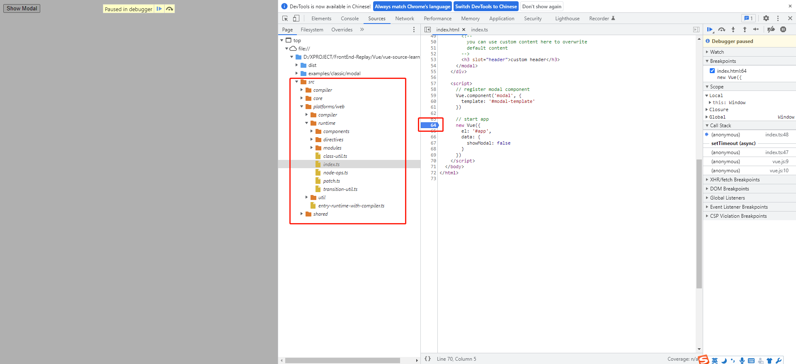

# chapter1 准备工作
本项目主要用于个人记录学习vue源码

## 一、项目托管
推荐使用Git来管理项目，我的项目依托于GitHub上。可以选择fork的方式，直接复制一份到仓库里来修改。

我的项目放在GitHub已有的仓库内，这就涉及到子模块（git submodule），[Git基础命令快查](http://www.taros.xyz/post/Git%E5%9F%BA%E7%A1%80%E5%91%BD%E4%BB%A4%E5%BF%AB%E6%9F%A5)有提到相关命令。

```shell
# 添加子模块到仓库中，并clone代码到指定目录下
git submodule add https://github.com/vuejs/vue.git vue-source-learning/vue
```

## 二、源码目录结构
先了解下下载下来的源码目录都是做什么的
```
├── benchmarks                  性能、基准测试
├── dist                        构建打包的输出目录
├── examples                    案例目录
├── flow                        flow 语法的类型声明
├── packages                    一些额外的包，比如：负责服务端渲染的包 vue-server-renderer、配合 vue-loader使用的的 vue-template-compiler，还有 weex 相关的
│   ├── vue-server-renderer
│   ├── vue-template-compiler
│   ├── weex-template-compiler
│   └── weex-vue-framework
├── scripts                     所有的配置文件的存放位置，比如 rollup 的配置文件
├── src                         vue 源码目录
│   ├── compiler                # 编译器
│   ├── core                    # 运行时的核心包
│   │   ├── components          全局组件，比如 keep-alive
│   │   ├── config.js           一些默认配置项
│   │   ├── global-api          全局 API，比如熟悉的：Vue.use()、Vue.component() 等
│   │   ├── instance            Vue 实例相关的，比如 Vue 构造函数就在这个目录下
│   │   ├── observer            响应式原理
│   │   ├── util                工具方法
│   │   └── vdom                虚拟 DOM 相关，比如熟悉的 patch 算法就在这儿
│   ├── platforms               # 其它平台相关的编译器代码
│   │   ├── web
│   │   └── weex
│   ├── server                  # 服务端渲染相关
│   ├── sfc                     # .vue 文件解析
│   ├── shared                  # 共享代码
├── test                        测试目录
├── types                       TS 类型声明

```

### compiler
compiler 目录包含 Vue.js 所有编译相关的代码。它包括把模板解析成 ast 语法树，ast 语法树优化，代码生成等功能。

编译的工作可以在构建时做（借助 webpack、vue-loader 等辅助插件）；也可以在运行时做，使用包含构建功能的 Vue.js。显然，编译是一项耗性能的工作，所以更推荐前者——离线编译。

### core
core 目录包含了 Vue.js 的核心代码，包括内置组件、全局 API 封装，Vue 实例化、观察者、虚拟 DOM、工具函数等等。

这里的代码可谓是 Vue.js 的灵魂，也是我们之后需要重点分析的地方。

### platform
Vue.js 是一个跨平台的 MVVM 框架，它可以跑在 web 上，也可以配合 weex 跑在 native 客户端上。platform 是 Vue.js 的入口，2 个目录代表 2 个主要入口，分别打包成运行在 web 上和 weex 上的 Vue.js。

我们会重点分析 web 入口打包后的 Vue.js，对于 weex 入口打包的 Vue.js，感兴趣的同学可以自行研究。

### server
Vue.js 2.0 支持了服务端渲染，所有服务端渲染相关的逻辑都在这个目录下。注意：这部分代码是跑在服务端的 Node.js，不要和跑在浏览器端的 Vue.js 混为一谈。

服务端渲染主要的工作是把组件渲染为服务器端的 HTML 字符串，将它们直接发送到浏览器，最后将静态标记"混合"为客户端上完全交互的应用程序。

### sfc
通常我们开发 Vue.js 都会借助 webpack 构建， 然后通过 .vue 单文件来编写组件。

这个目录下的代码逻辑会把 .vue 文件内容解析成一个 JavaScript 的对象。

### shared
Vue.js 会定义一些工具方法，这里定义的工具方法都是会被浏览器端的 Vue.js 和服务端的 Vue.js 所共享的。

## 三、开发调试
### 1. 依赖安装
vue迁移到pnpm管理了，可以看到````pnpm-lock.yaml````文件，所以这里我也用pnpm来安装依赖。当然用其他的````yarn````和````npm````都可以。

```shell
pnpm i
```

#### ？puppeteer 依赖安装问题：
vue 2.6版本安装依赖时报错，以下是错误的代码。

```sh
Progress: resolved 833, reused 832, downloaded 0, added 0, done
node_modules/.pnpm/puppeteer@14.1.1/node_modules/puppeteer: Running install script, failed in 47.2s
.../node_modules/puppeteer install$ node install.js
│ ERROR: Failed to set up Chromium r991974! Set "PUPPETEER_SKIP_DOWNLOAD" env variable to skip download.
│ Error: read ECONNRESET
│     at TLSWrap.onStreamRead (node:internal/stream_base_commons:217:20) {
│   errno: -4077,
│   code: 'ECONNRESET',
│   syscall: 'read'
│ }
└─ Failed in 47.2s
 ELIFECYCLE  Command failed with exit code 1.
```

看了下是无法下载Chromium内核，应该是“网络原因”，尝试了解决网络问题还是不行。

那么只能按照提示信息的去跳过该下载，执行````npm i puppeteer --ignore-scripts````这个命令就可以了。

参考：[puppeteer 安装失败的解决办法](https://blog.csdn.net/weixin_34216036/article/details/87958371)


### 2. 打包源码
vue 采用 rollup 打包工具，在 package.json -> scripts 中的 dev 命令中添加 ````--sourcemap````

```json
{
  "scripts": {
    "dev": "rollup -w -c scripts/config.js --sourcemap --environment TARGET:web-full-dev"
  }
}
```

生成带sourcemap的vue文件：
```shell
pnpm run dev
```

dist 目录下会生成 ````vue.js.map```` 和 ````vue.js```` 文件，则表示成功。.map后缀的文件作用是在浏览器中调试代码时，可以映射源码中的位置。注意这个命令不是启动服务。

### 3. 浏览器中调试项目
一切准备就绪，可以尝试下。

vue源码中随意找个示例````\examples\classic\modal\index.html````，将script中引入的路径改为刚刚生成的````vue.js````文件，看到以下截图中的源码就没问题了。打个断点，就可以正常跳转到 `src` 源码中的文件。



#### 调试技巧
Chrome 浏览器打开F12控制台，
右侧 `Scope` -> `Global` -> `Vue` ，这里右键点击，选中选项 `show function definition`。即可跳转到当前定义Vue构造函数的文件，在此文件右键 `Reveal in sidebar` 可以显示当前文件所在菜单的位置。这里是 Vue 实例相关的代码，比如 Vue 构造函数就在这个目录下。这里推荐用vscode调试，个人感觉使用起来更好用。


## 四、构建文件

### 1. 构建文件分类
在命令行中执行`pnpm run build`，会打包所有版本的vue文件，打包结果如下：

|  | UMD | CommonJS | ES Module |
| --- | --- | --- | --- |
| **Full** | vue.js | vue.common.js | vue.esm.js |
| **Runtime-only** | vue.runtime.js | vue.runtime.common.js | vue.runtime.esm.js |
| **Full (production)** | vue.min.js | vue.common.prod.js |  |
| **Runtime-only (production)** | vue.runtime.min.js | vue.runtime.common.prod.js |  |

### 2. 名词解释

-  **Full**：这是一个全量的包，包含编译器（`compiler`）和运行时（`runtime`）。
    
-  **Compiler**：编译器，负责将模版字符串（即你编写的 template 语法的模版代码）编译为 JavaScript 语法的 render 函数。
    
-  **Runtime**：负责创建 Vue 实例、渲染函数、patch 虚拟 DOM 等代码，基本上除了编译器之外的代码都属于运行时代码。
    
-  **UMD**：兼容 CommonJS 和 AMD 规范，通过 CDN 引入的 vue.js 就是 UMD 规范的代码，包含编译器和运行时。
    
-  **CommonJS**：典型的应用比如 nodeJS，CommonsJS 规范的包是为了给 browserify 和 webpack 1 这样旧的打包器使用的。他们默认的入口文件为 `vue.runtime.common.js`。
    
-  **ES Module**：现代 JavaScript 规范，ES Module 规范的包是给像 webpack 2 和 rollup 这样的现代打包器使用的。这些打包器默认使用仅包含运行时的 `vue.runtime.esm.js` 文件。

### 3. Runtime Only VS Runtime + Compiler
Runtime + Compiler 版本指的是完整版，就是 `vue.js` 这个文件。下面我们来对比这两个版本。

-   Runtime Only（运行时）

运行时版本的代码体积更轻量。我们在使用 Runtime Only 版本的 Vue.js 的时候，通常需要借助如 webpack 的 vue-loader 工具把 .vue 文件编译成 JavaScript。

运行时实际上流程：Render ——> VDom ——> 真实的Dom ——> 最终页面


-   Runtime + Compiler（运行时 + 编译器）

我们如果没有对代码做预编译，但又使用了 Vue 的 template 属性并传入一个字符串。

（运行时 + 编译器）的流程：Template ——> AST ——> Render ——> VDom ——> 真实的Dom ——> 最终页面


本文参考：
* [Vue.js 技术揭秘](https://ustbhuangyi.github.io/vue-analysis/)
* [大前端进阶-读懂vuejs源码1](https://segmentfault.com/a/1190000023740736)
* [Vue 源码解读（1）—— 前言](https://juejin.cn/post/6949370458793836580)
* [Git基础命令快查](http://www.taros.xyz/post/Git%E5%9F%BA%E7%A1%80%E5%91%BD%E4%BB%A4%E5%BF%AB%E6%9F%A5)